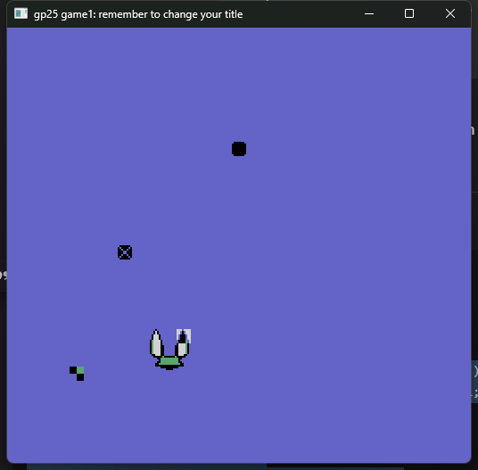

# Send Them Back

Author: Alex Ding

Design: Control the spaceship to take comet and send them back to crash each other 

Screen Shot:

How Your Asset Pipeline Works:

Store PNG in Asset file;
Load PNG to Pixel buffer；
Make them into 8X8；
Extract 4 color for each 8X8；
Each tile gets assigned a palette；
Push out Tile and Palette file;
Load into PPU446

(TODO: make sure the source files you drew are included. You can [link](your/file.png) to them to be a bit fancier.)

How To Play:

WASD to move, Space to shoot 

This game was built with [NEST](NEST.md).

